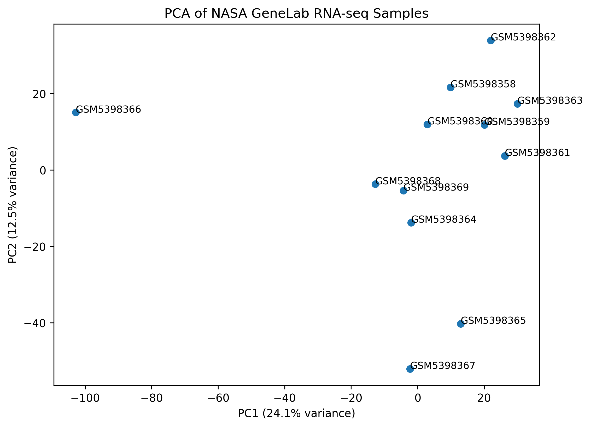
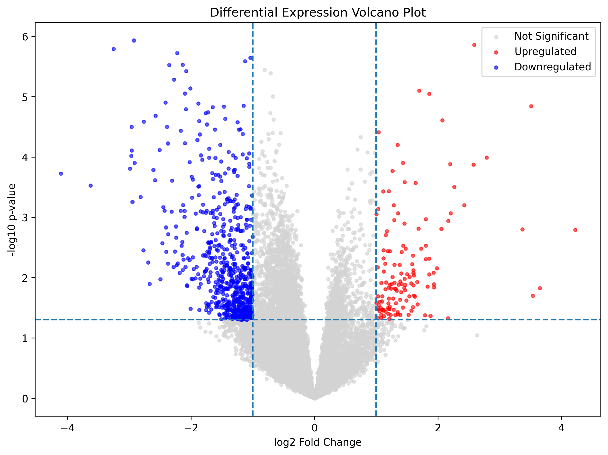
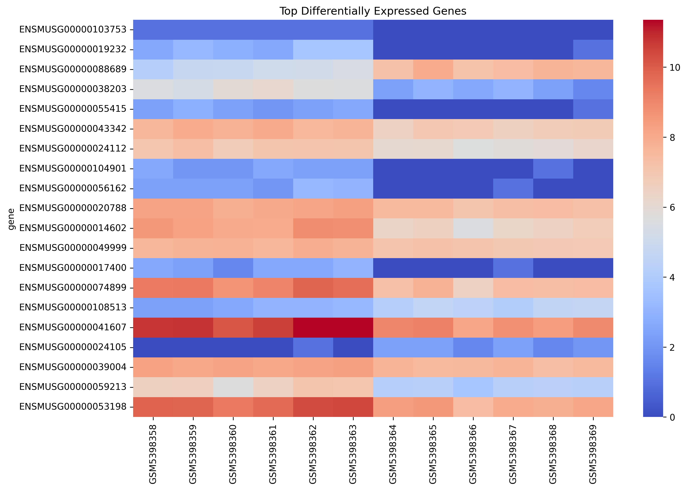

# NASA Spaceflight RNA-seq Analysis

RNA-seq differential expression analysis of NASA GeneLab spaceflight samples.

This project explores transcriptomic changes associated with spaceflight conditions using exploratory bioinformatics workflows, statistical analysis, reproducible computing practices, and cloud-deployed visualization tools.

---

## Project Highlights

✔ NASA GeneLab RNA-seq dataset analysis

✔ Principal Component Analysis (PCA)

✔ Differential gene expression analysis

✔ Volcano plot visualization

✔ Gene expression heatmaps

✔ Interactive Streamlit dashboard

✔ Dockerized reproducible workflow

✔ Cloud deployment

✔ End-to-end bioinformatics pipeline

---

## Project Overview

Spaceflight exposes biological systems to unique environmental stressors including microgravity, radiation exposure, altered circadian rhythms, and physiological adaptation.

Understanding how these factors influence gene expression is important for space biology, astronaut health, and long-duration space missions.

This project performs exploratory transcriptomic analysis of NASA GeneLab RNA-seq data to identify gene expression changes associated with spaceflight conditions and demonstrate a reproducible bioinformatics workflow.

---

## Main Findings

### Spaceflight induces measurable transcriptomic changes

PCA analysis revealed separation between experimental sample groups, suggesting global gene expression differences associated with spaceflight conditions.

### Differentially expressed genes were identified

Statistical analysis identified significantly upregulated and downregulated genes between study groups.

### Transcriptomic responses show coordinated biological patterns

Heatmap visualization demonstrated structured expression patterns among the most dysregulated genes.

### Reproducible bioinformatics workflows can be deployed in the cloud

The project integrates RNA-seq analysis, visualization, containerization, and dashboard deployment into a reproducible workflow.

---

## Main Figures

### PCA Analysis



Principal Component Analysis revealed transcriptomic variability between experimental sample groups.

---

### Differential Expression Analysis



Volcano plot highlighting significantly upregulated and downregulated genes.

---

### Gene Expression Heatmap



Heatmap visualization of the most differentially expressed genes.

---

## Dataset

### NASA GeneLab OSD-401

Source:

https://osdr.nasa.gov/bio/repo/data/studies/OSD-401

The dataset contains RNA-seq measurements collected as part of NASA GeneLab investigations focused on biological responses to spaceflight-associated conditions.

---

## Analysis Workflow

```text
Raw RNA-seq Counts
        ↓
Quality Assessment
        ↓
Log Transformation
        ↓
Principal Component Analysis
        ↓
Differential Expression Analysis
        ↓
Volcano Plot Generation
        ↓
Heatmap Visualization
        ↓
Interactive Dashboard Deployment
```

---

## Methods

The workflow includes:

- RNA-seq count preprocessing
- Exploratory transcriptomic analysis
- Principal Component Analysis (PCA)
- Differential gene expression analysis
- Volcano plot visualization
- Heatmap generation
- Interactive dashboard development
- Containerized deployment using Docker

---

## Repository Structure

```text
spaceflight-rnaseq-analysis/
│
├── data/
│
├── figures/
│   ├── pca_plot.png
│   ├── volcano_plot_colored.png
│   └── heatmap_top_genes.png
│
├── notebooks/
│
├── app/
│   └── streamlit_app.py
│
├── Dockerfile
│
├── requirements.txt
│
└── README.md
```

---

## Technologies

### Bioinformatics & Data Science

- Python
- Pandas
- NumPy
- SciPy
- Scikit-learn

### Visualization

- Matplotlib
- Seaborn
- Streamlit

### Reproducibility & Deployment

- Docker
- Git
- GitHub

### Development Environment

- Jupyter Notebook

---

## Running with Docker

### Build Image

```bash
docker build -t nasa-rnaseq-analysis .
```

### Run Container

```bash
docker run -p 8888:8888 nasa-rnaseq-analysis
```

---

## Potential Applications

This project demonstrates how transcriptomic data can be used to investigate biological adaptation to extreme environments.

Potential applications include:

- Space biology research
- Astronaut health monitoring
- Long-duration mission planning
- Radiation response studies
- Physiological adaptation research
- Bioinformatics workflow development
- Reproducible computational biology

---

## Skills Demonstrated

### Bioinformatics

- RNA-seq analysis
- Differential expression analysis
- Transcriptomic data exploration
- Biological interpretation

### Data Science

- PCA
- Statistical analysis
- Data visualization
- Exploratory data analysis

### Software Engineering

- Docker containerization
- Streamlit application development
- Reproducible workflows
- Git version control

### Cloud & Deployment

- Dashboard deployment
- Containerized applications
- Cloud-ready architecture

---

## Future Work

- Gene Ontology (GO) enrichment analysis
- KEGG pathway analysis
- Gene Set Enrichment Analysis (GSEA)
- Additional NASA GeneLab datasets
- Multi-omics integration
- Automated cloud-based pipelines
- Interactive biological pathway exploration

---

## Disclaimer

This project is intended for educational, research, and portfolio purposes.

The analyses presented are exploratory and should not be interpreted as validated biological conclusions without further experimental verification.

---

## License

This repository is provided for educational and research purposes.

---

## Author

**Agata Gabara**

MSc Bioinformatics Student

Research Interests:

- Space Biology
- Transcriptomics
- Computational Biology
- Bioinformatics
- Data Science
- Multi-Omics Integration

GitHub: https://github.com/ag48665

LinkedIn: https://www.linkedin.com/in/agatha-gabara-06494a37/
